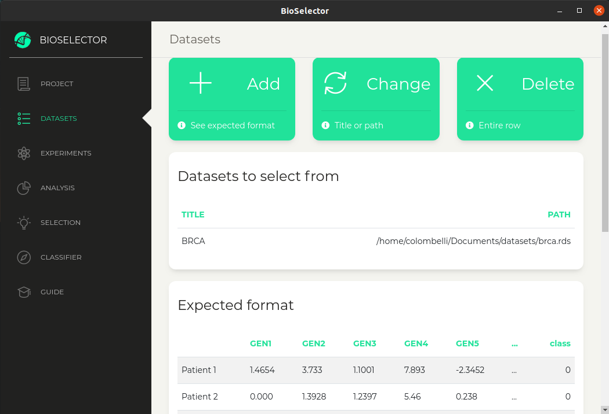
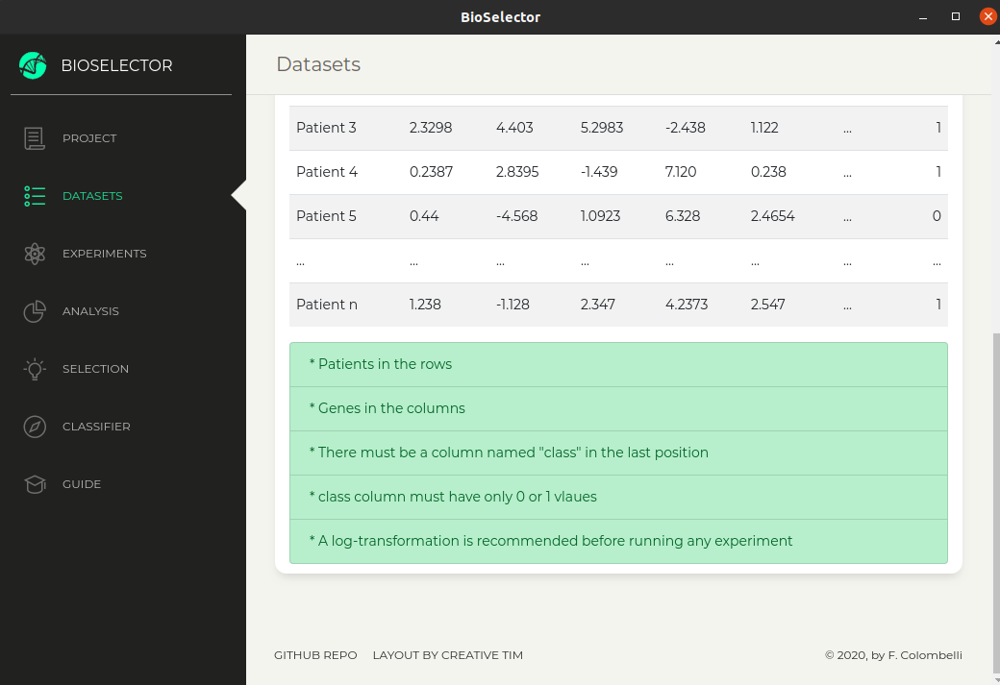
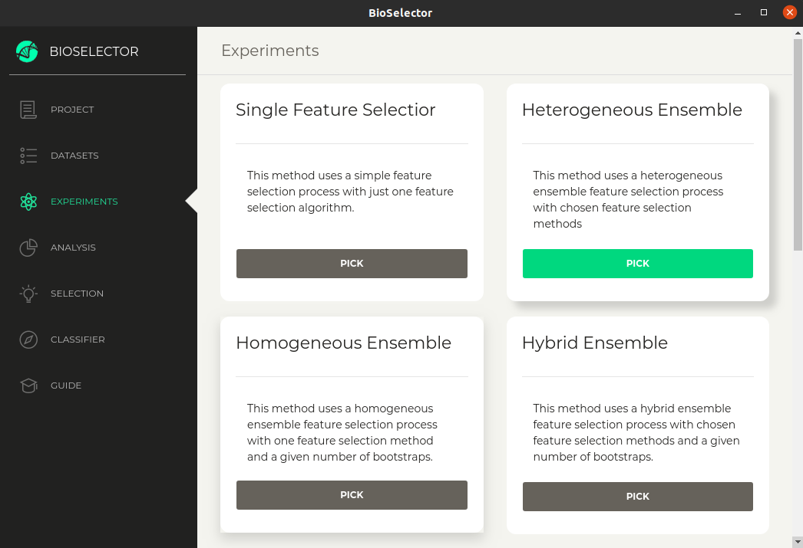
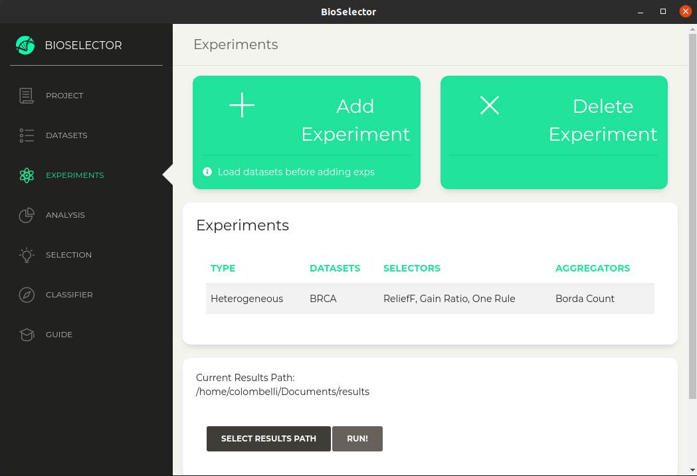

# BioSelector

* **Electron Cross-Platformed** 

## Description

BioSelector is a cross-platform application powered by machine learning that provides Ensemble and other Feature Selection
techniques for biomarker discovery. Despite different domain problems could benefit from it if the dataset model fits the
required one, we still didn't investigated its potential beyond gene expression kind of data.

The application is part of a scientific ongoing study about Ensemble Feature Selection for biomarker discovery out of 
RNA-seq and Microarray datasets provided by [TCGA][tcga]. Its pre-print is still not available, so you can use BioSelector
considering the current license.

## Current Stage

Right now, the application is at an early stage development and its MVP was only executed on Linux systems. 
The application was built using Electron back-ended with Python/R/rJava/Rcpp and front-ended with React framework utilizing a
template provided freely by [Creative Tim][creative-tim].

After more testing and a formal paper submission, this README will be updated with a detailed usage and installation guide. 

## Screenshots

 

  

    
  

  

    
  

 

 
 

  

    
  

  

    
  

 

[creative-tim]: https://www.creative-tim.com/
[tcga]: https://www.cancer.gov/about-nci/organization/ccg/research/structural-genomics/tcga
